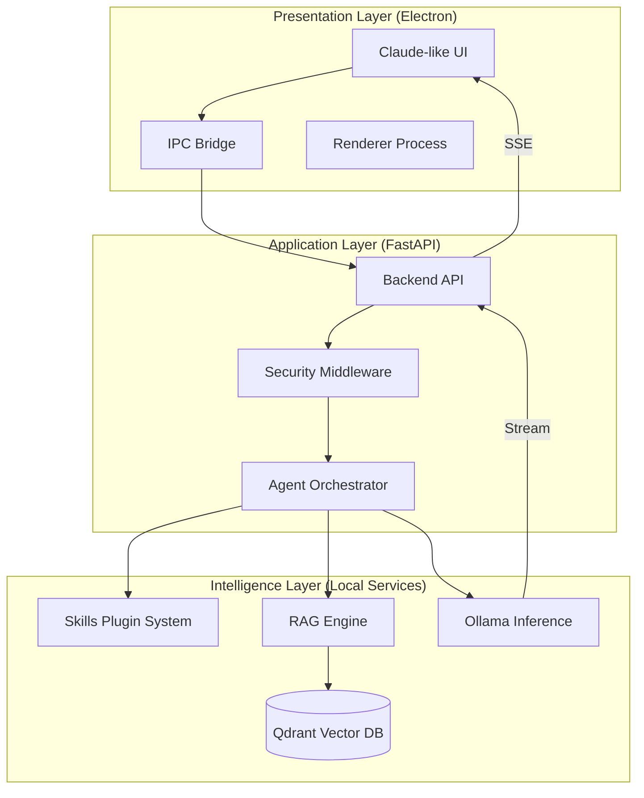

# Seclib AI Desktop: Production Architecture

Seclib AI Desktop is designed as a local-first, modular AI assistant that integrates advanced reasoning, extensible skills, and high-performance RAG capabilities into a premium desktop experience.

## 1. System Architecture Diagram



## 2. Modular Folder Structure

```text
/home/fatsio/rag-engine/
├── frontend/             # Desktop UI & Shell
│   ├── components/       # UI Logic (Chat, Nav, Settings)
│   ├── assets/           # Premium Fonts & Styles
│   └── main.js           # Electron Main Process (System Integration)
├── backend/              # Application Logic
│   ├── routes/           # API Endpoints
│   ├── middleware/       # Security & Validation
│   └── main.py           # FastAPI Orchestration
├── engine/               # Core Intelligence
│   ├── agent.py          # Reasoning Loop (Think-Plan-Act)
│   ├── rag.py            # Vector Search & Knowledge Ingestion
│   ├── skills.py         # Plugin Registry & Loader
│   └── security.py       # Secret Detection & Sandboxing
├── skills/               # JSON Plugin Definitions (Hot-swappable)
├── data/                 # Local Persistence
│   ├── knowledge/        # Raw Indexed Files
│   └── qdrant_storage/   # Vector Database Files
├── scripts/              # Lifecycle Management (start, push, install)
└── docker-compose.yml    # Infrastructure Definition
```

## 3. System Design Explanation

### A. Modular "Skills" System
The architecture treats AI capabilities as hot-swappable JSON plugins. This allows the system to remain "Thin" while providing infinite extensibility. Each skill defines a behavior (e.g., Code Reviewer) via prompt injection without requiring code changes to the core Agent.

### B. Local-First RAG Pipeline
The RAG engine is decoupled from the LLM provider. It uses Qdrant (Dockerized) for sub-millisecond retrieval and Ollama for embedding generation. This ensures that user data never leaves the local machine.

### C. Security Middleware
A production-grade security layer sits between the API and the Agent. It performs real-time regex-based scanning for secrets (API keys, SSH keys) and validates user inputs against a whitelist of safe operations, preventing prompt injection attacks from accessing the filesystem.

### D. Streaming Event Architecture
The system uses **Server-Sent Events (SSE)** for all AI interactions. This ensures a "zero-latency" feel where the UI updates as each token is generated, rather than waiting for the entire response to be completed.

## 4. Future Cloud Extension Design
The architecture is "Cloud-Ready" through an optional Gateway Layer. By swapping the `Ollama` implementation with an `OpenAI-compatible` client, the system can transition to cloud LLMs (Anthropic, OpenAI) while maintaining local RAG and security boundaries.
